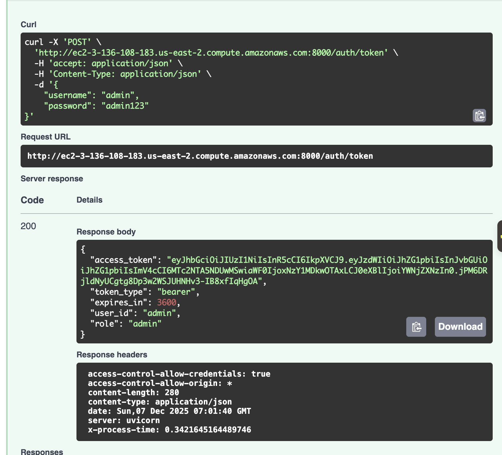
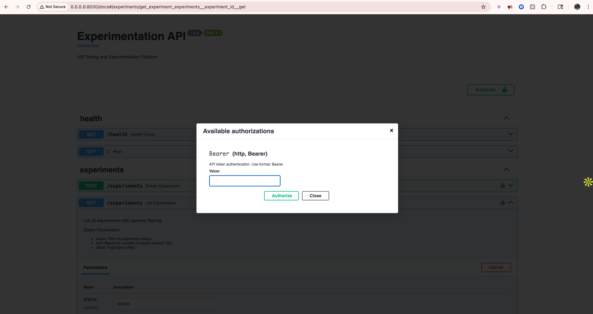
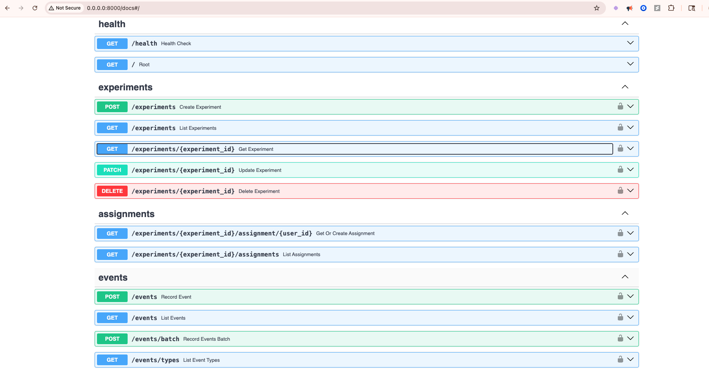

# API Endpoints & Usage Guide

All endpoints (except `/health` and `/auth/*`) require JWT Bearer token authentication.

---

## Quick Start: Run Demo Script

The `runTest.sh` script creates 3 realistic e-commerce A/B tests with different confidence levels:

| Experiment | Users | Expected Confidence |
|------------|-------|---------------------|
| Dark Mode Beta | 20 | LOW |
| Checkout Button | 250 | MEDIUM |
| Free Shipping | 1200 | HIGH |

**Run locally:**
```bash
bash runTest.sh
# or
bash runTest.sh http://localhost:8000
```

**Run against deployed EC2:**
```bash
bash runTest.sh http://ec2-3-136-108-183.us-east-2.compute.amazonaws.com:8000
```

---

## Authentication Endpoints




### `POST /auth/token` - Login and get JWT token
```bash
curl -X POST http://localhost:8000/auth/token \
  -H "Content-Type: application/json" \
  -d '{"username": "admin", "password": "admin123"}'
```

### `POST /auth/register` - Register a new user
```bash
curl -X POST http://localhost:8000/auth/register \
  -H "Content-Type: application/json" \
  -d '{"username": "newuser", "password": "password123", "role": "user"}'
```

### `GET /auth/users` - List all users (Just for the purpose of development, shouldn't be used in production) 
```bash
curl http://localhost:8000/auth/users
```

---

## Health Endpoint

### `GET /health` - Health check
```bash
curl http://localhost:8000/health
```

---

## Experiment Endpoints

### `POST /experiments` - Create a new experiment
```bash
curl -X POST http://localhost:8000/experiments \
  -H "Authorization: Bearer <token>" \
  -H "Content-Type: application/json" \
  -d '{
    "name": "Button Color Test",
    "description": "Testing blue vs green buttons",
    "variants": [
      {"name": "control", "traffic_allocation": 50, "config": {"color": "blue"}},
      {"name": "treatment", "traffic_allocation": 50, "config": {"color": "green"}}
    ]
  }'
```

### `GET /experiments` - List all experiments
```bash
curl http://localhost:8000/experiments \
  -H "Authorization: Bearer <token>"
```

### `GET /experiments/{id}` - Get experiment details
```bash
curl http://localhost:8000/experiments/1 \
  -H "Authorization: Bearer <token>"
```

### `PATCH /experiments/{id}` - Update experiment (status, name, etc.)
```bash
curl -X PATCH http://localhost:8000/experiments/1 \
  -H "Authorization: Bearer <token>" \
  -H "Content-Type: application/json" \
  -d '{"status": "running"}'
```

### `DELETE /experiments/{id}` - Delete a draft experiment
```bash
curl -X DELETE http://localhost:8000/experiments/1 \
  -H "Authorization: Bearer <token>"
```

---

## Assignment Endpoints

### `GET /experiments/{id}/assignment/{user_id}` - Get/create user's variant assignment (Idempotent)
```bash
# First call creates assignment
curl http://localhost:8000/experiments/1/assignment/user-123 \
  -H "Authorization: Bearer <token>"

# Subsequent calls return the SAME assignment
curl http://localhost:8000/experiments/1/assignment/user-123 \
  -H "Authorization: Bearer <token>"
```

### `GET /experiments/{id}/assignments` - List all assignments for experiment
```bash
curl http://localhost:8000/experiments/1/assignments \
  -H "Authorization: Bearer <token>"
```

---

## Event Endpoints

### `POST /events` - Record a single event
```bash
curl -X POST http://localhost:8000/events \
  -H "Authorization: Bearer <token>" \
  -H "Content-Type: application/json" \
  -d '{
    "user_id": "user-123",
    "event_type": "purchase",
    "timestamp": "2024-01-15T10:30:00Z",
    "properties": {"amount": 99.99, "currency": "USD"}
  }'
```

### `POST /events/batch` - Record multiple events
```bash
curl -X POST http://localhost:8000/events/batch \
  -H "Authorization: Bearer <token>" \
  -H "Content-Type: application/json" \
  -d '{
    "events": [
      {"user_id": "user-1", "event_type": "click", "timestamp": "2024-01-15T10:00:00Z", "properties": {}},
      {"user_id": "user-2", "event_type": "purchase", "timestamp": "2024-01-15T10:05:00Z", "properties": {"amount": 50}}
    ]
  }'
```

### `GET /events` - Query events
```bash
curl "http://localhost:8000/events?user_id=user-123&event_type=purchase" \
  -H "Authorization: Bearer <token>"
```

### `GET /events/types` - List all event types
```bash
curl http://localhost:8000/events/types \
  -H "Authorization: Bearer <token>"
```

---

## Results Endpoints

### `GET /experiments/{id}/results` - Get experiment performance results
```bash
# Full results
curl http://localhost:8000/experiments/1/results \
  -H "Authorization: Bearer <token>"

# Summary only
curl "http://localhost:8000/experiments/1/results?format=summary" \
  -H "Authorization: Bearer <token>"

# With time series for charts
curl "http://localhost:8000/experiments/1/results?include_time_series=true" \
  -H "Authorization: Bearer <token>"

# Filter by event type
curl "http://localhost:8000/experiments/1/results?event_types=purchase,signup" \
  -H "Authorization: Bearer <token>"
```

### `GET /experiments/{id}/results/export` - Export raw experiment data
```bash
curl http://localhost:8000/experiments/1/results/export \
  -H "Authorization: Bearer <token>"
```

---


## Swagger Documentation (Directly Access Endpoints)


